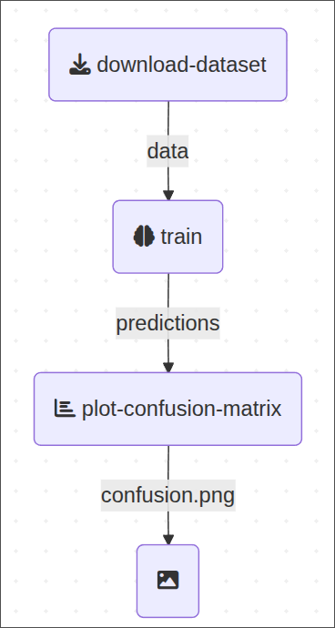

Do you find this work useful? Don't forget to give it a GitHub ⭐ to help others find and trust it!

# Kubeflow Pipeline meets uv

There is a more exhaustive explanation in [this blog post](https://fabridamicelli.github.io/posts/kubeflow-uv.html)

Here's code that implements a custom kubeflow pipeline components with dynamic dependency resolution
Typically, when defining a Kubeflow Pipeline component, you explicitly list the Python packages to install using the packages_to_install argument in `kfp.dsl.component` or by baking them into a custom Docker image
This repository showcases a custom approach to defining Kubeflow Pipeline components that automatically resolve their Python package dependencies based on a `pyproject.toml` file.
This simplifies component development and management by centralizing dependency declarations.


## Usage

Make sure you have `uv` installed and available in your system.

To run the pipeline, navigate to the project's root directory and run `pipeline.py`.

Using `uv`:
```bash
uv run pipeline.py
```

Activating virtual environment manually:
```bash
source .venv/bin/activate
python pipeline.py
```

Per default the script will run this simple pipeline:

<p align="center">
  
</p>


That will:
 - Run locally using a [`DockerRunner`](https://www.kubeflow.org/docs/components/pipelines/user-guides/core-functions/execute-kfp-pipelines-locally/#runner-types)
 - Write the outputs to the local folder `local_outputs`

At the end you should see under `/local_outputs/pipelie-<timestampt>/plot-confusion-matrix/confusion_plot.png` a plot like this:

<p align="center">
  
</p>

